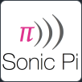

# 👨‍💻 Christian Cricchi

**`Junior Full Stack Web Application Developer`**

I am an independent full-stack Web Application Developer and a digital content creator. My mission is to shape the digital world according to my vision, progressing step by step. 
Each of my programming projects starts from scratch: from the initial planning and design phase to implementing concrete solutions for real-life problems through code.Currently, I am enhancing my skills in Computer Science at University of the West of England. 

I have already obtained a Level 5 qualification in Full Stack Web Application Developer at 
.

  

---

## 🛠️ Technical Skills

### 🧰 **Languages**

 

[SonicPi](https://sonic-pi.net)

---

### 🧰 **Frameworks and Libraries**

   

          
---

### 🧰 **Database**

 

---

### 🧰 **Cloud**

          

         

 

---

### 🧰 **Development Tools**

       

                  
 

---

## 👷‍♂️ My recent projects

          
          
          
          

          

          
          
        
          
          

