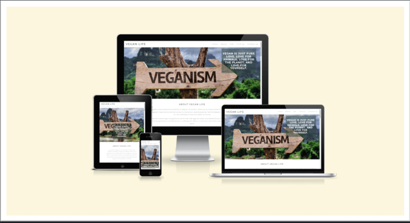

# 👨‍💻 Christian Cricchi

**`Junior Full Stack Web Application Developer`**

I am an independent full-stack Web Application Developer and a digital content creator. My mission is to shape the digital world according to my vision, progressing step by step. 
Each of my programming projects starts from scratch: from the initial planning and design phase to implementing concrete solutions for real-life problems through code.Currently, I am enhancing my skills in Computer Science at University of the West of England. 

I have already obtained a Level 5 qualification in Full Stack Web Application Developer at 
.

  

---

## 🛠️ Technical Skills

### 🧰 **Languages**

 

---

### 🧰 **Frameworks and Libraries**

   

          
---

### 🧰 **Database**

 

---

### 🧰 **Cloud**

          

 

---

### 🧰 **Development Tools**

       

          `                      
 

---

### 🧰 **Tools**

 

[SonicPi](https://sonic-pi.net)

 

---

## 👷‍♂️ My recent projects

### Shelly's Corner | [GitHub Repository](https://github.com/ChristianCricchi/shelly-s_corner)

### Daily Flight Planner | [GitHub Repository](https://github.com/ChristianCricchi/Daily_Flight_Planner)

### ChecKnowledge | [GitHub Repository](https://github.com/ChristianCricchi/ChecKnowledge)

### Vegan Life | [GitHub Repository](https://github.com/ChristianCricchi/Vegan-Life)

### Love Maths | [GitHub Repository](https://github.com/ChristianCricchi/love-maths)

### Bingo Page | [GitHub Repository](https://christiancricchi.github.io/BingoPage/)

---

## Hackathon Experience

- I participated in the "Proud Coders 🏳️‍🌈: July 2024 Hackathon" at Code Institute, where I developed an app celebrating diversity and inclusivity in the LGBTQ+ community. The website features the Progress Pride Flag, a modified version of the traditional Pride Flag that includes additional colors to represent marginalized groups within the community.

---

## Certifications

- [Hackathon at Code Institute](https://eu.badgr.com/public/assertions/y3Lq8msXTR2_5VU1XgLYXw?identity__email=christiancricchi@gmail.com): Obtained in Octuber 2023

## Contact

Feel free to connect me through the following platforms:

- **LinkedIn**: [Christian Cricchi](https://www.linkedin.com/in/christian-cricchi-9a185075/)
- **Email**: christiancricchi@gmail.com

          

          
          
        
          
          

